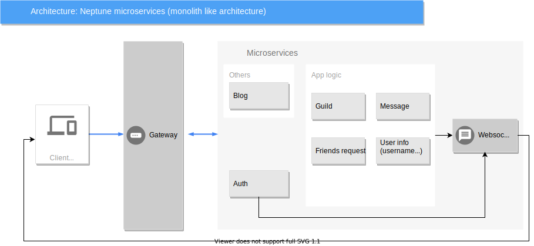

# Neptune App

## What is Neptune ?

Neptune is a secure communication application, on the ethic aspect or the technical one.  You can chat with your friends, work with your team, all your daily tasks all of this knowing that your private data will be under your control.
Peer to peer hashing and no log policy, everything to insure your anonymity.
Every data will be hashed, it goes for calls, messages, to the tiny things.
Only the strict minimum of data will be kept just to make the app work, nothing else!

## Architecture

We intend here to share the application architecture diagram as a representation of how the app is supposed to work

## Contributing

Please read [Contributing.md](https://github.com/NeptuneOrg/guideline/blob/main/CONTRIBUTING.md) before contributing.
